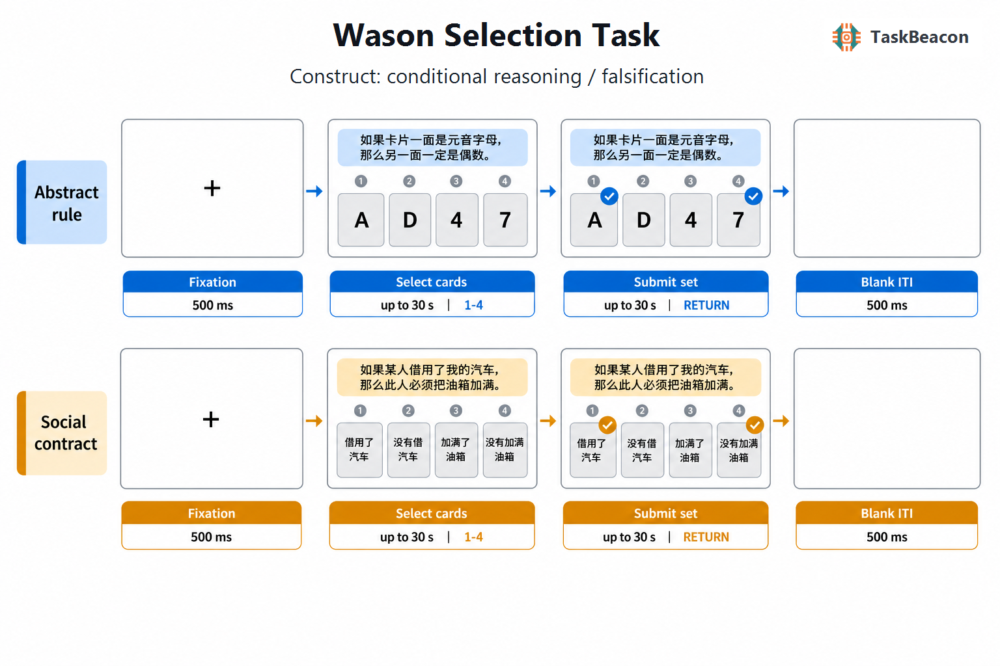

# Wason Selection Task

| Field | Value |
|---|---|
| Name | Wason Selection Task |
| Version | v0.1.0 |
| URL / Repository | https://github.com/TaskBeacon/T000098-wason-selection-task |
| Short Description | Four-card test of conditional falsification reasoning and matching bias. |
| Created By | TaskBeacon |
| Date Updated | 2026-08-24 |
| PsyFlow Version | Current TaskBeacon workspace version |
| PsychoPy Version | Workspace runtime version |
| Modality | Behavior |
| Language | Chinese |
| Voice Name | zh-CN-YunyangNeural (voice disabled) |

## 1. Task Overview

The Wason Selection Task measures conditional reasoning and the ability to search for potentially falsifying evidence. On every trial, participants see a rule of the form “If P, then Q” and four visible card faces corresponding to P, not-P, Q, and not-Q. The normative response is to inspect P and not-Q, the only visible cases that can reveal a violation.

This implementation balances abstract descriptive problems with familiar social-contract problems. It records exact-set accuracy as well as common P-only and P+Q matching responses.

## 2. Task Flow



### Block-Level Flow

| Stage | Description |
|---|---|
| Instructions | Explain the four-card rule test, numbered card selection, and Return submission. |
| One task block | Present 8 trials: four item labels with equal frequency in seeded random order. |
| Completion | Save trial-level CSV and a condition-family summary JSON. |

### Trial-Level Flow

| Phase | Duration | Participant-visible content | Response |
|---|---:|---|---|
| Fixation | 500 ms | Centered `+` | None |
| Card selection | Up to 30 s per decision | Rule, four cards, current selected set, response hint | `1`–`4` add a card; Return submits |
| ITI | 500 ms | Blank screen | None |

The selection screen redraws after each card choice, marking chosen cards with `✓`. No correctness feedback is shown.

### Controller Logic

No adaptive controller is used. `BlockUnit.generate_conditions(...)` balances the four config-defined item labels with an even/default weight policy and a participant-specific block seed.

### Other Logic

The response set is scored without regard to selection order. `[1, 4]` is normative P/not-Q; `[1, 3]` is classified as P+Q matching; `[1]` is classified as P-only.

## 3. Configuration Summary

### a. Subject Info

| Field | Configuration |
|---|---|
| Participant ID | Three-digit numeric ID in human mode; deterministic IDs in QA/simulation. |

### b. Window Settings

| Setting | Value |
|---|---|
| Size | 1280 × 720 px |
| Background | White |
| Font | SimHei for Chinese participant-facing text |
| Fullscreen | Disabled by default |

### c. Stimuli

| Family | Items | Visible structure |
|---|---|---|
| Abstract | vowel/even; shape/color | Rule above four gray cards |
| Social contract | car/fuel; drink/age | Rule above four gray person-status cards |

### d. Timing

| Parameter | Human value |
|---|---:|
| Fixation | 0.5 s |
| Decision window | 30.0 s per selection step |
| ITI | 0.5 s |

### e. Triggers

Structured trigger codes distinguish experiment/block lifecycle, fixation, first abstract/social selection displays, selection updates, each numbered card choice, submission, timeout, ITI, and completion.

### f. Adaptive Controller

None.

## 4. Methods (for academic publication)

Participants completed a computerized Wason four-card selection task. Each trial displayed a Chinese conditional rule and four numbered cards representing P, not-P, Q, and not-Q. Participants selected cards with number keys 1–4 and submitted the chosen set with Return. The task included abstract and social-contract content while holding the logical form constant. The exact P/not-Q set was scored as normative; common P+Q matching and P-only responses were additionally classified. Trial order was randomized from a participant-specific seed. No trial-level correctness feedback was provided.

Run from the task directory:

```powershell
python main.py human
python main.py qa --config config/config_qa.yaml
python main.py sim --config config/config_scripted_sim.yaml
python main.py sim --config config/config_sampler_sim.yaml
```

Reference provenance and inference decisions are documented under `references/`.
